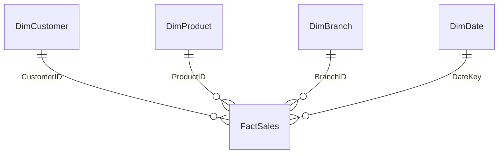

# Power BI Business Dashboard

A complete retail executive dashboard project prepared for Microsoft Power BI. It includes a validated star-schema dataset, reusable Power Query transformations, DAX measures, a branded theme and a page-by-page dashboard specification.

## Business questions

1. How are revenue, gross profit and margin changing over time?
2. Which branches and product categories perform best?
3. Which customers contribute the most revenue?
4. What is the return and cancellation rate?
5. Where should management focus sales and margin improvement work?

## Included assets

| Asset | Purpose |
|---|---|
| `assets/data/PowerBI_Source_Data.xlsx` | Validated star-schema source with 3,000 transactions |
| `power_query/` | Power Query M scripts for all five model tables |
| `dax/Measures.dax` | Complete KPI and time-intelligence measure library |
| `theme/Executive_Blue_Theme.json` | Importable Power BI theme |
| `docs/Report_Build_Guide.md` | Step-by-step dashboard construction instructions |
| `docs/Data_Dictionary.md` | Table grain, columns and definitions |
| `docs/Dashboard_Specification.md` | Visuals, filters and interaction design |
| `sql/validation_queries.sql` | Source reconciliation and quality checks |

## Data model

All relationships are one-to-many with single-direction filtering from dimensions to the fact table. Mark `DimDate[Date]` as the date table.

## Dashboard pages

1. Executive Overview
2. Sales Trends
3. Product Performance
4. Branch Performance
5. Customer Analysis
6. Data Quality

## Quick start

1. Open Power BI Desktop.
2. Select **Get data → Excel workbook**.
3. Choose `assets/data/PowerBI_Source_Data.xlsx`.
4. Load `FactSales`, `DimCustomer`, `DimProduct`, `DimBranch` and `DimDate`.
5. Create the relationships described above.
6. Import `theme/Executive_Blue_Theme.json` through **View → Themes → Browse for themes**.
7. Create the measures from `dax/Measures.dax`.
8. Build the pages using `docs/Dashboard_Specification.md`.

## Portfolio strengths

- Clean star-schema modelling
- 3,000 synthetic retail transactions
- DAX time intelligence and ranking
- Revenue, profit, margin and customer KPIs
- Reusable Power Query staging logic
- Branded, accessible dashboard theme
- Data-quality and reconciliation framework
- Power BI-ready Excel data source

## Author

Michael Duve

## Licence

MIT License.
